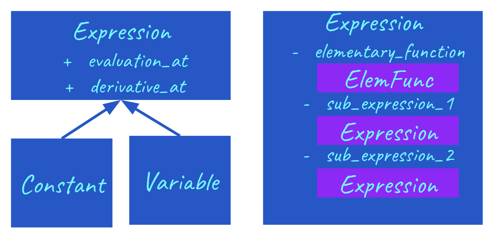
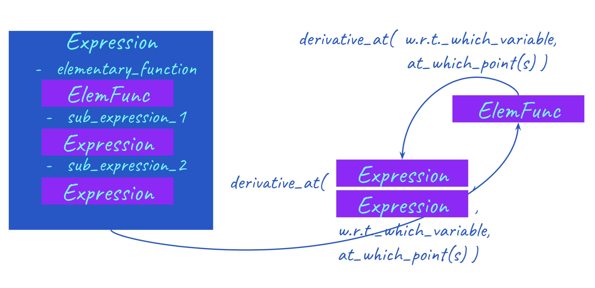
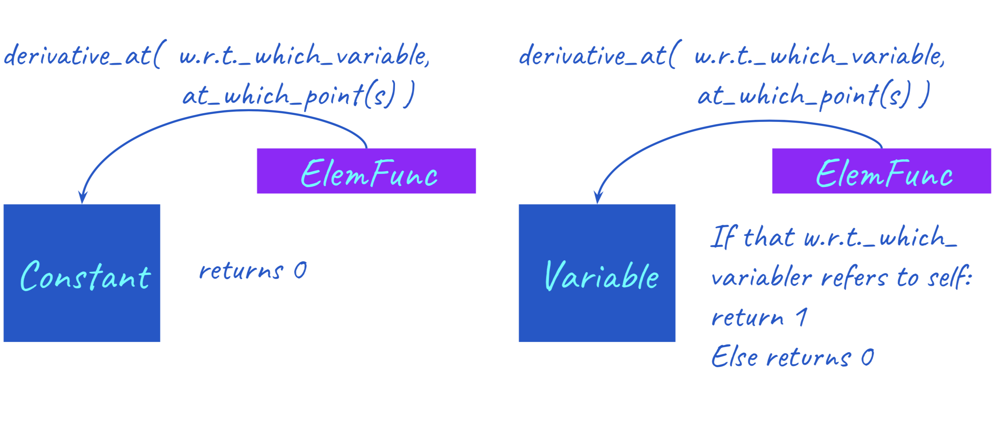
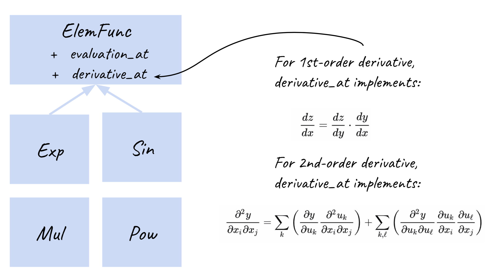

# cs207-FinalProject
`autodiff` 
by

**Group Name:** DFYS

**Group Number:** 12

**Group Member:**  Feiyu Chen, Yueting Luo, Yan Zhao

[](https://travis-ci.org/D-F-Y-S/cs207-FinalProject)

[](https://coveralls.io/github/D-F-Y-S/cs207-FinalProject?branch=master)

[](https://cs207-finalproject.readthedocs.io/en/latest/?badge=latest)

# Table of Content
* [Introduction](#Introduction)
* [Background](#Background)
* [How to use the package](#How to use the package)
    * [Installing autodiff](#Installing-autodiff)
    * [Getting Started](#Getting-Started)
* [Software Organization](#Software-Organization)
    * [Directory Structure](#Directory-Structure)
    * [Modules](#Modules)
    * [Test Automation](Test-Automation)
    * [Distribution](Distribution)
* [Implementation Details](#Implementation-Details)
    * [High-level Design](#High-level-Design)
    * [Core Classes](#Core-Classes)
    * [External Dependencies](#External-Dependencies)
* [Proposal for Additional Features](#Proposal-for-Additional-Features)
 

----
## Introduction

Automatic differentiation (AD) is a family of techniques for efficiently and accurately evaluating derivatives of numeric functions expressed as computer programs. Application of AD includes Newton’s method for solving nonlinear equations, real-parameter optimization, probabilistic inference, and backpropagation in neural networks. AD has been extremely popular because of the booming development in machine learning and deep learning techniques. Our AD sofeware package enables user to calculate derivatives using both the forward mode and the reverse mode. 

----
## Background

**Mathematical Background**

Automatic Differentiation decomposes a complex function into a sequence of operations on elementary functions, evaluates the derivatives at each intermediate stage, repeatedly applies the chain rule to obtain the derivative of the outermost function.
We provides explanations for related math concepts below. 

**Elimentary functions**

The class of functions consisting of the polynomials, the exponential functions, the logarithmic functions, the trigonometric functions, the inverse trigonometric functions,and the functions obtained from those listed by the four arithmetic operations and by superposition(i.e. composition),applied by finitely many times.

**Chain Rule**
+ Used to compute the derivative of a composite function
+ Core of automatic differentiation

For the first derivative:
$$\dfrac{dy}{dx} = \dfrac{dy}{du}\cdot\dfrac{du}{dx}$$
For the second derivative:
$$\dfrac{\partial^2 t}{\partial x_i \partial x_j} = \sum_k(\dfrac{\partial y}{\partial u_k}\dfrac{u_k^2}{\partial x_i \partial x_j}) + \sum_{k,l}(\dfrac{\partial^2 y}{\partial u_k \partial u_l}\dfrac{\partial u_k}{\partial x_i}\dfrac{\partial u_l}{\partial x_j})$$
**Topological Graph**
+ Each node represent a variable
+ Arrows indicate topological orders(order of operations) and operations themselves.


**Forward Mode Autodifferentiation**

Follow the topological order and store the values of each variable in the nodes.
visit each node in topological order. Let x denote our innermost function. For variable $u_i=g_i(v)$ we already know $\dfrac{dv}{dx}$, calculate $\dfrac{du_i}{dx}= \dfrac{du_i}{dv}\dfrac{dv}{dx}$


**Reverse Mode Autodifferentiation**

Has forward computation and backward computation

    **Forward Computation**
Follow the topological order and store the values of each variable in each nodes.
    
    
    **Backward Computation**
let y denote our final output variable and $u_j$, $v_j$ denote the intermediate variables
1. Initialize all partial derivative $\dfrac{dy}{du_j}$ to 0 and dy/dy = 1
2. visit each node in reverse topological order. For variable $u_i=g_i(v_1,...,v_n)$ we already know $\dfrac{dy}{du_i}$, increment $\dfrac{dy}{dv_j}$ by $\dfrac{dy}{du_i}\dfrac{du_i}{dv_j}$


----
## How to use the package

### Installing `autodiff`

the easiest way to install `autodiff` is by `pip`. Just type in `pip install DYFS-autodiff` in the command line.


```bash
!pip install DFYS-autodiff
```


Or, the user can choose to install `autodiff` directly from the source in this repository. We suppose that the user has already installed `pip` and `virtualenv`:
1. clone the project repo by `git clone git@github.com:D-F-Y-S/cs207-FinalProject.git`
2. `cd` into the local repo and create a virtual environment by `virtualenv env` 
3. activate the virtual environment by `source env/bin/activate` (use `deactivate` to deactivate the virtual environment later.)
4. install the dependencies by `pip install -r requirements.txt`
5. install `autodiff` by `pip install -e .`

### Getting Started

#### Univariate Functions

The standard workflow for `autodiff` is to first initiate a `Variable`, or several `Variable`s. We then use these `Variable` to construct `Expression`s, which can then be queried for values and derivatives.


```python
import numpy              as np
import matplotlib.pyplot  as plt
from mpl_toolkits.mplot3d import Axes3D

from autodiff.forward     import *
```

Suppose we want to calculate the derivatives of $f(x) = \cos(\pi x)\exp(-x^2)$. We can start with creating a `Variable` called x.


```python
x = Variable()
```

We then create the `Expression` for $f(x)$. Note that here `cos` and `exp` are library functions from `autrodiff`.


```python
f = cos(np.pi*x)*exp(-x**2)
```

We can then evaluate $f(x)$'s value and derivative by calling the `evaluation_at` method and the `derivative_at` method. For `derivative_at` method, the first argument specifies which variable to take derivative with respect to, the second argument specifies which point in the domain are the derivative to be calculated.


```python
f.evaluation_at({x: 1})
```


    -0.36787944117144233


```python
f.derivative_at(x, {x: 1})
```


    0.7357588823428846


The `derivative_at` method supports second order derivative. If we want to calculate $\dfrac{d^2 f}{d x^2}$, we can add another argument `order=2`.


```python
f.derivative_at(x, {x: 1}, order=2)
```


    2.895065669313077


Both the methods `evaluation_at` and `derivative_at` are vectorized, and instead of pass in a scalar value, we can pass in a `numpy.array`, and the output will be `f`'s value / derivative at all entried of the input. For example, we can calculate the value, first order derivative and second order derivative of $f(x)$ on the interval $[-2, 2]$ simply by


```python
interval = np.linspace(-2, 2, 200)
values = f.evaluation_at(   {x: interval})
der1st = f.derivative_at(x, {x: interval})  
der2nd = f.derivative_at(x, {x: interval}, order=2)
```

Let's see what they look like.


```python
fig  = plt.figure(figsize=(16, 8))
plt.plot(interval, values, c='magenta',     label='$f(x)$')
plt.plot(interval, der1st, c='deepskyblue', label='$\dfrac{df(x)}{dx}$')
plt.plot(interval, der2nd, c='purple',      label='$\dfrac{d^2f(x)}{dx^2}$')
plt.xlabel('x')
plt.legend()
plt.show()
```


#### Multivariate Functions

The workflow with multivariate functions are essentially the same.

Suppose we want to calculate the derivatives of $g(x, y) = \cos(\pi x)\cos(\pi y)\exp(-x^2-y^2)$. We can start with adding another `Variable` called y.


```python
y = Variable()
```

We then create the `Expression` for $g(x, y)$.


```python
g = cos(np.pi*x) * cos(np.pi*y) * exp(-x**2-y**2)
```

We can then evaluate $f(x)$'s value and derivative by calling the `evaluation_at` method and the `derivative_at` method, as usual.


```python
g.evaluation_at({x: 1.0, y: 1.0})
```


    0.1353352832366127


```python
g.derivative_at(x, {x: 1.0, y: 1.0})
```


    -0.27067056647322535


```python
g.derivative_at(x, {x: 1.0, y: 1.0})
```


    -1.0650351405815222


Now we have two variables, we may want to calculate $\dfrac{\partial^2 g}{\partial x \partial y}$. We can just replace the first argument of `derivative_at` to a tuple `(x, y)`. In this case the third argument `order=2` can be omitted, because the `Expression` can infer from the first argument that we are looking for a second order derivative.


```python
g.derivative_at((x, y), {x: 1.0, y: 1.0})
```


    0.5413411329464506


We can also ask `g` for its Hessian matrix. A `numpy.array` will be returned.


```python
g.hessian_at({x: 1.0, y:1.0})
```


    array([[-1.06503514,  0.54134113],
           [ 0.54134113, -1.06503514]])


Since the `evaluation_at` method and `derivarive_at` method are vectorized, we can as well pass in a mesh grid, and the output will be a grid of the same shape. For example, we can calculate the value, first order derivative and second order derivative of  f(x)f(x)  on the interval  $x\in[−2,2], y\in[-2,2]$  simply by


```python
us, vs = np.linspace(-2, 2, 200), np.linspace(-2, 2, 200)
uu, vv = np.meshgrid(us, vs)
```


```python
values = g.evaluation_at(        {x: uu, y:vv})
der1st = g.derivative_at(x,      {x: uu, y:vv})  
der2nd = g.derivative_at((x, y), {x: uu, y:vv})
```

Let's see what they look like.


```python
def plt_surf(uu, vv, zz):
    fig  = plt.figure(figsize=(16, 8))
    ax   = Axes3D(fig)
    surf = ax.plot_surface(uu, vv, zz, rstride=2, cstride=2, alpha=0.8, cmap='cool')
    ax.set_xlabel('x')
    ax.set_ylabel('y')
    ax.set_zlabel('z')
    ax.set_proj_type('ortho')
    plt.show()
```


```python
plt_surf(uu, vv, values)
```


```python
plt_surf(uu, vv, der1st)
```


```python
plt_surf(uu, vv, der2nd)
```


#### Vector Functions

Functions defined on $\mathbb{R}^n \mapsto \mathbb{R}^m$ are also supported. Here we create an `VectorFunction` that represents $h(\begin{bmatrix}x\\y\end{bmatrix}) = \begin{bmatrix}f(x)\\g(x, y)\end{bmatrix}$.


```python
h = VectorFunction(exprlist=[f, g])
```

We can then evaluates $h(\begin{bmatrix}x\\y\end{bmatrix})$'s value and gradient ($\begin{bmatrix}\dfrac{\partial f}{\partial x}\\\dfrac{\partial g}{\partial x}\end{bmatrix}$ and $\begin{bmatrix}\dfrac{\partial f}{\partial y}\\\dfrac{\partial g}{\partial y}\end{bmatrix}$) by calling its `evaluation_at` method and `gradient_at` method. The `jacobian_at` function returns the Jacobian matrix ($\begin{bmatrix}\dfrac{\partial f}{\partial x} & \dfrac{\partial f}{\partial y} \\ \dfrac{\partial g}{\partial x} & \dfrac{\partial g}{\partial y} \end{bmatrix}$).


```python
h.evaluation_at({x: 1.0, y: -1.0})
```


    array([-0.36787944,  0.13533528])


```python
h.gradient_at(0, {x: 1.0, y: -1.0})
```


    array([0., 0.])


```python
h.jacobian_at({x: 1.0, y: -1.0})
```


    array([[ 0.73575888,  0.        ],
           [-0.27067057,  0.27067057]])


----
## Software Organization

### Directory Structure

The structure of `autodiff`'s project directory is as follows. 
```
autodiff/

    __init__.py
    forward.py
    backward.py
    optimize.py
    rootfinding.py
    plot.py
    
tests/

    test_forward.py
    test_backward.py
    test_optimize.py
    test_rootfinding.py
    test_plot.py   
    
docs/

    milestone1.ipynb
    milestone2.ipynb
    document.ipynb
    
.gitignore
.travis.yml
LICENSE.txt
README.md
requirements.txt
setup.cfg
setup.py
```

The source codes lies in the directory `autodiff`, in which the `__init__.py` is there to make `autodiff` a package. The file `forward.py` contains the source code of forward mode autodifferentiation. The file `backward.py` contains the source code of backward mode autodifferentiation. The file `optimize.py` contains optimization routines built on top of autodifferentiation. The file `rootfinding.py` contains rootfinding routines. The file `plot.py` contains utility functions for plotting.

The test suites lies in the directory `tests`. The test files are named to represent the module that they test.

The documents lies in the directory `docs`. `milestone1.ipynb` is the history version of document when submitting milestone 1. `milestone2.ipynb` is the history version of document when submitting milestone 2. `document.ipynb`, which is this file itself, is the final document.

Other files in the rrot directory includes: `.gitignore`, which specifies the files that should not be tracked by git, `.travis.yml`, which is the configuration file for TravisCI, `LICENSE.txt`, which is the license for this package, `README.md`, which is the README file for this package, `requirements.txt`, which specifies the dependensies of this package, `setup.cfg`, which is the configuration file for installing this package, `setup.py`, which is the script for installing this package.

### Modules

There are now five modules: `autodiff.forward` for forward mode autodifferentiation, `backward` for backward mode autodifferentiation, `optimize` for optimization, `rootfinding` for rootfinding, and `plot` for plotting.

### Test Automation

The continuous integration is done by `TravisCI` and `Coveralls`.

### Distribution

`autodiff ` is distributed with `PyPI`.

----
## Implementation Details

### High-level Design

#### Core Functions: Static Structure

The centural data structure in `autodiff` are `Expression` and `ElementaryFunction` (which is the common interface shared by `Add`, `Mul`, `Pow`, `Exp`, `Sin`...). `Expression` represents a mathematical expression. It is composed of one `ElementaryFunction`  plus two sub-`Expression`'s. `Expression` has two child class: `Variable`, which represents a 'base' variable and `Constant`, which represents a constant.



#### Core Functions: Dynamic Behavior

When a `Expression`'s `derivative_at` method is called, it will pass its sub-`Expression`('s) to the `ElementaryFunction`'s `derivative_at` method. `ElementaryFunction`'s `derivative_at` method will then compute the derivative based on chain rule. In this process, the `ElementaryFunction` will need the values and derivatives of the sub-`Expression`(s), so it will call the `evaluation_at` method and `derivative_at` method of the sub-`Expression`('s), and use the returned value to calculate the derivative. In other words, `Expression` and `ElementaryFunctions` will be calling each other recursively, until the base of this recursive process is reached. 



The base of this recursive process lies in the `Constant` class and the `Variable` class. When a `Constant` is called to give its derivative, it returns 0. When a `Variable` is called to give its derivative, it checks whether itself is the variable to be taken derivative with respect of, if yes, then it returns 1.0, otherwisem it returns 0.0.



#### On Second Order derivatives

The implementation of second order derivative is conceptually very similar to the implementation of first order derivative, except that it implements a different chain rule. The knowledge of the chain rule is encompassed within the `derivative_at` method of `ElementaryFunction`. Because all the `ElementaryFunction`s involves either one or two sub-`Expression`, the Faà di Bruno's formula is actually much less frightening to implement than it seems in the following figure.



### Core Classes

The core class of `autodiff` is `Expression` and its child classes (`Variable` and `Constant`). They share the same interface: all implements their own `evaluation_at` and `derivative_at` methods. The dunder methods of `Expression` is overridden so that any operation on `Expression` will also return an `Expression`. `Variable` and `Constant` inherites these dunder methods so that they have the same behavior as `Expression`.

`Expression` is composed of one `ElementaryFunction` and two sub-`Expression`s. `ElementaryFunction`s like `Sin`, `Exp` and `Add` implements the chain rule associated with the corresponding elementary function. Note that `sin` and `exp` are different from `Sin` and `Exp`. The former two are actually factory functions that returns a `Expression` which has `Sin` and `Exp` as its `ElementaryFunction`.

### External Dependencies

`autodiff` depends on `numpy`. All of `autodiff`'s calculation is done in numpy for the efficiency and the advantage of vectorization. The `optimize` moduel depends on `scipy` for solving linear systems. The `plot` module depends on `matplotlib` for plotting.
